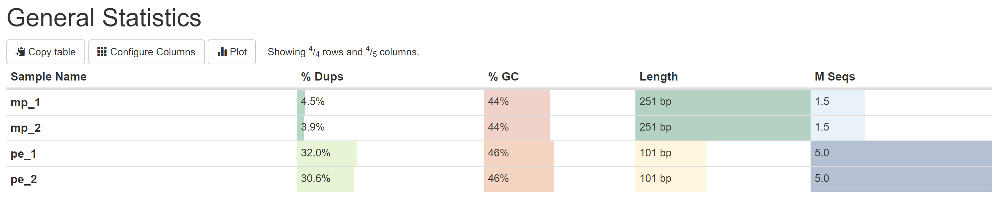
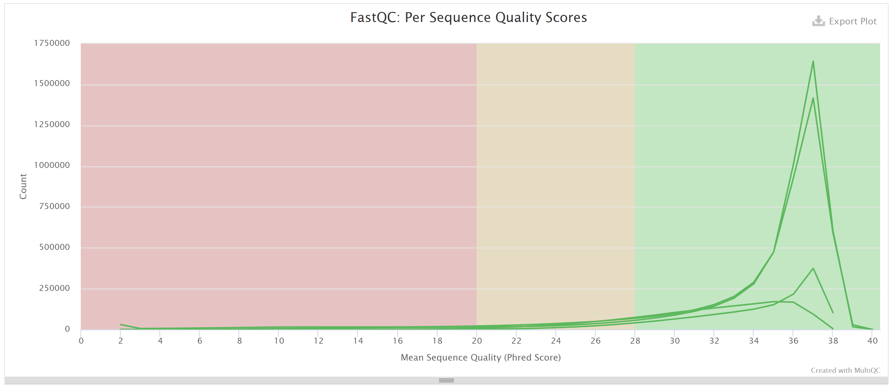
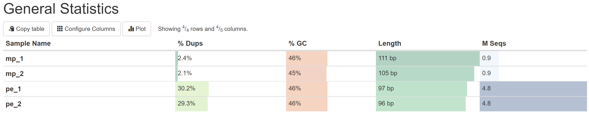
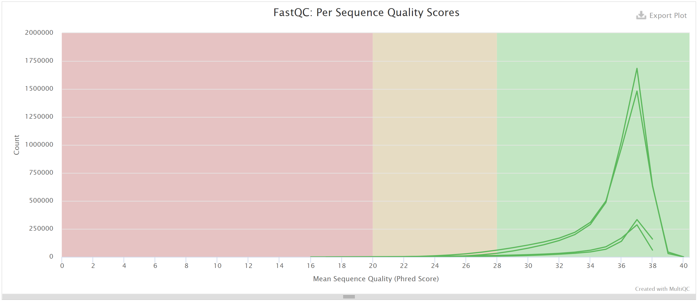
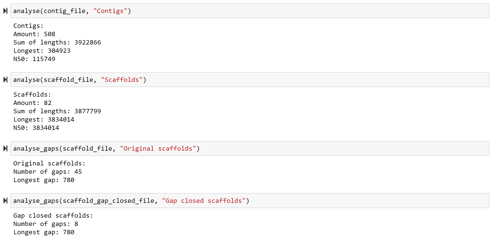

## Список команд

```
export DATA_DIR="/usr/share/data-minor-bioinf/assembly/"
ln -s $DATA_DIR* .
export S=508

export PE_LEN=5000000
export MP_LEN=1500000
seqtk sample -s$S oil_R1.fastq $PE_LEN > pe_1.fastq
seqtk sample -s$S oil_R2.fastq $PE_LEN > pe_2.fastq
seqtk sample -s$S oilMP_S4_L001_R1_001.fastq $MP_LEN > mp_1.fastq
seqtk sample -s$S oilMP_S4_L001_R2_001.fastq $MP_LEN > mp_2.fastq

mkdir fastqc
export SEQS="mp_1.fastq mp_2.fastq pe_1.fastq pe_2.fastq"
fastqc $SEQS -o fastqc
multiqc fastqc -o multiqc

platanus_trim pe*
platanus_internal_trim mp*
export TRIMMED_SEQS="$(ls *trimmed)"

mkdir trimmed_fastqc
mkdir trimmed_multiqc
fastqc $TRIMMED_SEQS -o trimmed_fastqc
multiqc trimmed_fastqc -o trimmed_multiqc

platanus assemble -f $TRIMMED_SEQS
platanus scaffold -c out_contig.fa -IP1 *.trimmed -OP2 *.int_trimmed
platanus gap_close -c out_scaffold.fa -IP1 *.trimmed -OP2 *.int_trimmed
```

## Скриншоты статистик

### До подрезания

#### Общая статистика



#### Качество чтения



### После подрезания

#### Общая статистика



#### Качество чтения



## Гэпы и статистики по контигам



## Ссылки на ноутбук

Ноутбук лежит [в репозитории](src/main.ipynb)
